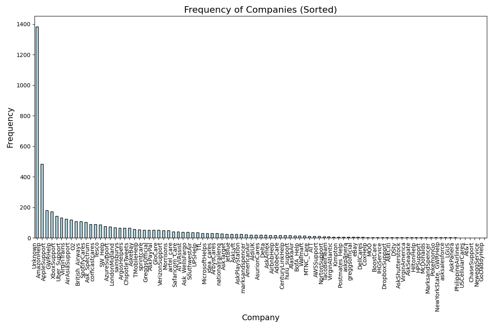

# README.md

## Projektbeschreibung

In diesem Projekt wurde ein Large Language Model (LLM), **ChatGPT-4o-mini**, speziell finetuned, um Kundensupportanfragen und Konversationen in Form von Tweets der richtigen Firma zuzuordnen. Das Ziel war es, ein Modell zu entwickeln, das anhand von Konversationsdaten erkennt, welche Firma hinter einer Anfrage steht. Das Finetuning, die Evaluation und die Anwendung wurden über die OpenAI-Schnittstelle umgesetzt. Die gesamte Applikation ist Docker-basiert und kann entsprechend in einer Container-Umgebung ausgeführt werden.

---

## Nutzung der Applikation

### Voraussetzungen
Stellen Sie sicher, dass Docker installiert ist, um die Anwendung ausführen zu können.

### Aufbau des Docker-Images
Das Dockerfile ist bereits vorbereitet und enthält alle notwendigen Abhängigkeiten und Modelle. Um das Image zu erstellen, führen Sie folgenden Befehl aus:

```bash
docker build -t mainwebsolutions_image .
```

Dieser Befehl baut das Docker-Image `mainwebsolutions_image`. Der Build dauert etwa 20 Minuten.

### Ausführung des Containers

Je nach gewünschter Aufgabe starten Sie den Container mit einem der folgenden Befehle:

#### 1. Modell Finetunen
Um das Modell zu trainieren, verwenden Sie:

```bash
docker run --rm -w /app mainwebsolutions_image finetune
```

#### 2. Status des Finetunings abfragen
Um den Status des letzten Finetuning-Jobs zu ermitteln, verwenden Sie:

```bash
docker run --rm -w /app mainwebsolutions_image status
```

#### 3. Modell auf Produktionsdaten anwenden
Um das zuletzt finetunete Modell auf Produktionsdaten anzuwenden, verwenden Sie:

```bash
docker run --rm -w /app mainwebsolutions_image apply
```

---

## Projektansatz

### Datenvorbereitung

#### Herunterladen der Daten
Die Trainingsdaten und Produktionsdaten wurden von folgender URL heruntergeladen:  
[Link zu den Daten](https://cloud.wegi-gmbh.de/index.php/s/gKcTM2ZZikbTBTR)  
Die Dateien wurden im Ordner `datasets` abgelegt.

---

### Preprocessing

#### 1. Aufbau von Konversationen aus Tweets
Die Tweets werden als gerichteter azyklischer Graph modelliert:
- **Knoten** repräsentieren Tweets.
- **Kanten** repräsentieren Antwortbeziehungen zwischen Tweets (ein Tweet ist die Antwort auf einen anderen).

Um Trainingsdaten zu generieren, werden Konversationen rekursiv von Anfang an aufgebaut:
- Für jeden Tweet wird iterativ der "Parent"-Tweet ermittelt, bis der erste Tweet einer Konversation erreicht ist.
- Anschließend wird die gesamte Konversation durch Traversieren der Kanten erstellt.

Die Firma einer Konversation wird wie folgt ermittelt:
- Entweder durch das `author_id`-Feld im CSV.
- Oder durch `@Mentions` im Text des Tweets.

**Wichtig:** Alle `@Mentions` und `author_id`-Felder werden entfernt, um Datenlecks zu vermeiden, da Produktionsdaten diese Informationen nicht enthalten.  
Wenn keine Firma zugeordnet werden kann, erhält die Konversation das Label `"Unknown"`. Das Modell wird darauf trainiert, keine falsche Zuordnung zu machen – eine bewusste Entscheidung zur Verbesserung der Modellgenauigkeit.

---

#### 2. Entfernung von Namen
Persönliche Namen wie "Sam" oder "Max" dürfen dem Modell aus Datenschutzgründen nicht gegeben werden. Um dies umzusetzen, wurde ein vortrainiertes Named Entity Recognition (NER)-Modell von Hugging Face verwendet: `51la5/roberta-large-NER`. Dieses Modell erkennt unter anderem Personennamen und ersetzt sie automatisch durch das Wort `"Person"`.

---

#### 3. Balancieren und Splitten der Daten
Die Daten wurden in **Trainings-** (90%) und **Validierungsdaten** (10%) aufgeteilt. Jede Klasse (Firma) wurde so balanciert, dass sie eine einheitliche Anzahl von Datenpunkten (`target_size`) enthält. Dieses Target wurde so gewählt, dass das Finetuning innerhalb des vorgegebenen Budgets bleibt.

---

### Finetuning

Das OpenAI-API wurde verwendet, um das Modell zu finetunen:
1. Die Trainings- und Validierungsdaten werden hochgeladen.
2. Das Finetuning läuft automatisch im Backend.
3. Der Status kann jederzeit abgefragt werden.

Nach Abschluss des Finetunings wird eine Datei `metrics/step_metrics.csv` heruntergeladen, die Trainings- und Validierungsmetriken enthält. 
- Der Trainingsverlust sinkt stetig, und die Genauigkeit steigt kontinuierlich, was auf ein gesundes Finetuning hindeutet.
- Die Validierungsgenauigkeit erreicht ca. **95%**, was ein hervorragendes Ergebnis darstellt.

Ein System-Prompt wurde speziell entworfen, um die Aufgabe des Modells verständlich zu machen. Das Modell wurde darauf trainiert, einer Konversation die korrekte Firma zuzuordnen oder `"Unknown"` auszugeben, falls keine Zuordnung möglich ist.

---

### Produktionsphase

Nach dem Finetuning kann die Applikation mit dem `apply`-Befehl auf die Produktionsdaten angewendet werden. Dabei wird das zuletzt finetunete Modell verwendet. Die Produktionsdaten werden ähnlich wie die Trainingsdaten vorverarbeitet. Jeder Tweet wird mindestens einmal in einer Konversation berücksichtigt.

Das Modell analysiert die Daten und speichert die Ergebnisse in einer CSV-Datei (`output/output.csv`). Die Spalte `company` zeigt an, welche Firma das Modell den Konversationen zugeordnet hat.

---

### Analyse der Ergebnisse

In der Produktionsphase hat das Modell ca. **1390/5000 Tweets** mit `"Unknown"` vorhergesagt. Dies entspricht der Erwartung, da das Modell besser nicht zuordnet, wenn es unsicher ist. Die restlichen Konversationen wurden einer Firma zugeordnet, und die Ergebnisse wirken auf den ersten Blick plausibel.

Zusätzlich wurde eine Analyse erstellt, wie oft das Modell jede Firma zugeordnet hat. Diese Analyse wird als Balkendiagramm in der Datei `output/analyze.png` gespeichert.




# Strategischer Planungsteil


Für ein globales Support-Center, das Hunderttausende von Anrufen täglich verarbeitet, wurde ein skalierbarer, modularer Ansatz entwickelt, der automatische Transkription, Verarbeitung und Klassifikation von Anrufen ermöglicht. Die Architektur ist in mehrere Mikrodienste aufgeteilt, um Effizienz und Flexibilität zu gewährleisten.

## Schlüsselkomponenten

1. **Automatische Spracherkennung (ASR):**
   - Transkribiert eingehende Anrufe in Echtzeit in Text.
   - Technologien: Google Speech-to-Text, AWS Transcribe oder Whisper.
   
2. **Preprocessing-Service:**
   - Anonymisiert und bereinigt die Transkripte.
   - Wandelt den Text in ein formatgerechtes Eingabeformat für das Modell um.
   
3. **Klassifikations-Service (Fine-tuned LLM):**
   - Verwendet ein feinabgestimmtes Modell, um die Firma/Bucket des Anrufs zu bestimmen.
   - Gibt entweder eine Firma oder "Unknown" zurück, falls die Zuordnung unsicher ist.

4. **Feedback- und Continuous-Learning-Modul:**
   - Sammelt Feedback und verbessert das Modell durch kontinuierliches Training mit Produktionsdaten.

5. **Resultatspeicherung und Dashboard:**
   - Ergebnisse werden in einer Datenbank gespeichert und auf einem Dashboard visualisiert.
   - Dashboards zeigen die Anzahl der Anrufe pro Firma, Prozentsätze von "Unknown" und weitere Trends.

## Infrastruktur

- **Echtzeit-Datenpipeline:** Apache Kafka oder AWS Kinesis stellt sicher, dass Datenströme zuverlässig verarbeitet werden.
- **Datenbank:** Speicherung und Analyse über PostgreSQL oder MongoDB.
- **Mikrodienste:** Jeder Dienst wird in Docker-Containern bereitgestellt und über Kubernetes orchestriert.
- **Sicherheit:** Alle Daten werden verschlüsselt (TLS), und GDPR-Vorgaben werden bei der Anonymisierung beachtet.

## Workflow

1. **Eingehende Anrufe:** 
   - Anrufe werden an den ASR-Service übermittelt.
2. **ASR-Service:** 
   - Wandelt Audio in Text um und leitet es weiter.
3. **Preprocessing-Service:** 
   - Entfernt Namen, bereinigt und formatiert den Text.
4. **Klassifikations-Service:** 
   - Führt die Klassifikation durch und gibt das Ergebnis zurück.
5. **Speicherung und Feedback:** 
   - Ergebnisse werden gespeichert, und ein Feedback-System sorgt für kontinuierliche Verbesserungen.

## Workflow-Diagramm

```plaintext
           +--------------------------------------+
           |    Incoming Phone Calls (Audio)      |
           +--------------------------------------+
                          |
                          v
           +--------------------------------------+
           |   Automatic Speech Recognition (ASR) |
           +--------------------------------------+
                          |
                          v
           +--------------------------------------+
           |      Preprocessing Service           |
           |  (Cleans & Anonymizes Transcripts)   |
           +--------------------------------------+
                          |
                          v
           +--------------------------------------+
           |  Classification Service (Fine-tuned) |
           |        LLM Model Inference           |
           +--------------------------------------+
                          |
                          v
           +-----------------------------+      +------------------+
           |      Result Storage         |----->| Real-Time Dashboard |
           +-----------------------------+      +------------------+
                          |
                          v
           +--------------------------------------+
           | Feedback & Continuous Learning Module|
           +--------------------------------------+
```

Dieses Diagramm illustriert den gesamten Workflow, von der Verarbeitung der eingehenden Anrufe bis zur Speicherung der Ergebnisse und der kontinuierlichen Verbesserung des Modells.


